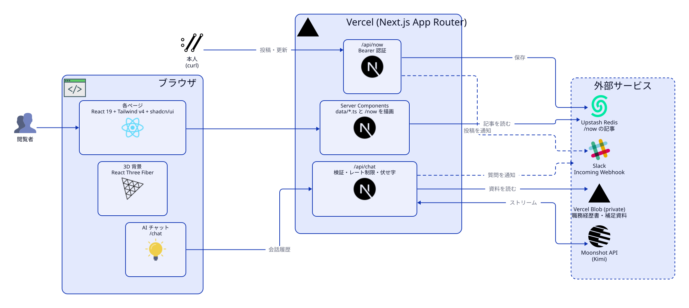
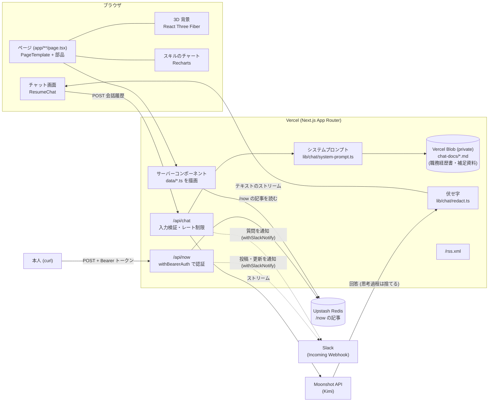
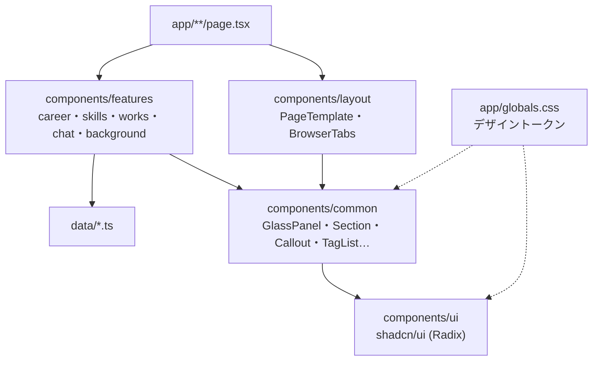

# Ryuki Tobita's Portfolio

フロントエンドからクラウド基盤まで手がけるエンジニア、Ryuki Tobita の個人ポートフォリオサイト。
ブラウザのタブを模した画面で経歴・スキル・作品を見せ、職務経歴について AI に質問できるチャットを備えている。

[](#技術)

## ページ

| パス | 内容 |
| --- | --- |
| `/` | トップ (Enter から各ページへ) |
| `/overview` | 概要・プロフィール |
| `/career` | 経歴のタイムライン。フリーランス期は参画案件の詳細をダイアログで見られる |
| `/skills` | スキルのレーダーチャート (概要 / フロントエンド / バックエンド / AWS) と資格 |
| `/works` | 制作物。カードから詳細とアーキテクチャを開ける |
| `/now` | いま取り組んでいること ([nownownow.com](https://nownownow.com/about) の考え方)。記事を新しい順のカードで並べ、押すと Markdown・Mermaid の全文をモーダルで読める |
| `/api/now` | /now の記事の投稿 (POST)、書き換え (PUT `/api/now/[id]`)、削除 (DELETE `/api/now/[id]`)。トークンが要る |
| `/chat` | 職務経歴について答える AI チャット (Moonshot / Kimi) |
| `/theme` | 背景の 3D シーンを選ぶ (グリッド / オーロラ / 月夜の海 / 蛍の森 / 月面 / 皆既日食) |
| `/rss.xml` | RSS フィード |

全ページの背後に three.js の 3D 背景 (`/theme` で選べる) があり、その上にガラス調のパネルを重ねるデザイン (ダークテーマ既定)。

## アーキテクチャ

<picture>
  <source media="(prefers-color-scheme: dark)" srcset="docs/architecture/architecture-dark.svg">
  
</picture>

図のソースと描き直し方は [docs/architecture/](docs/architecture/README.md) ([ADR 0020](docs/adr/0020-readme-architecture-diagram-d2.md))。

### 詳細



### 画面の部品の層



### 技術

| 領域 | 採用しているもの | 理由 |
| --- | --- | --- |
| フレームワーク | Next.js (App Router)、TypeScript、pnpm | [ADR 0002](docs/adr/0002-framework-and-hosting.md) |
| ホスティング | Vercel | 同上 |
| UI | Tailwind CSS v4、shadcn/ui (Radix)、lucide、Motion | [ADR 0003](docs/adr/0003-ui-foundation.md) |
| デザイン | ダーク既定・青のアクセント・ガラス調のトークン | [ADR 0004](docs/adr/0004-design-theme.md)、[docs/design/theme.md](docs/design/theme.md) |
| 部品の構成 | ui / common / layout / features + data | [ADR 0005](docs/adr/0005-component-architecture.md)、[docs/design/components.md](docs/design/components.md) |
| 可視化・3D | React Three Fiber、Recharts | [ADR 0006](docs/adr/0006-visualization-and-3d.md) |
| AI チャット | Moonshot / Kimi、自前のプロンプト + 伏せ字 + プライバシー eval | [ADR 0008](docs/adr/0008-chat-llm-and-privacy-eval.md) |
| Now の記事 | Upstash Redis (REST)、react-markdown + remark-gfm、Mermaid | [ADR 0015](docs/adr/0015-now-posts-storage-and-markdown.md) |
| 通知 | Slack (Incoming Webhook)。`withSlackNotify` デコレータで、/now の投稿・更新と AI チャットへの質問を知らせる | [ADR 0018](docs/adr/0018-slack-notify-decorator.md) |
| テスト | Playwright (E2E)、Vitest、axe | [ADR 0001](docs/adr/0001-testing-strategy.md) |
| 品質ゲート | ESLint、GitHub Actions (`ci-ok`)、コミットゲート | [ADR 0007](docs/adr/0007-ci-quality-gate.md)、[ADR 0009](docs/adr/0009-commit-gate.md) |
| README の図 | D2 (全体像)、Mermaid (詳細) | [ADR 0020](docs/adr/0020-readme-architecture-diagram-d2.md) |

## 開発

```bash
pnpm install
cp .env.example .env.local   # チャットを動かすなら MOONSHOT_API_KEY を書く (なくても他のページは動く)
pnpm dev                     # http://localhost:3000
```

| 目的 | コマンド |
| --- | --- |
| lint / 型チェック | `pnpm lint` / `pnpm typecheck` |
| 書式 | `pnpm format` / `pnpm format:check` |
| ユニットテスト (Vitest) | `pnpm test:unit` |
| E2E テスト (Playwright、デスクトップ + スマホ幅) | `pnpm test:e2e` |
| ルート × 観点のカバレッジ表 | `pnpm test:coverage-map` |
| CI と同じ確認 (E2E 以外) | `pnpm check` |
| コミット前の検査 | `pnpm commit-gate` |
| チャットのプライバシー eval (本物の LLM を呼ぶ) | `pnpm eval:privacy` |

- テストの観点は [testing/e2e-policy.yml](testing/e2e-policy.yml)、網羅状況は [docs/testing/coverage-map.md](docs/testing/coverage-map.md)
- E2E・ユニットは LLM を必ずモックする。本物の LLM を呼ぶのは eval だけ ([evals/privacy/](evals/privacy/README.md))

## Now の記事を投稿する

/now の記事は API で足す。トークン (`NOW_POST_TOKEN`) と保存先 (Upstash Redis) は Vercel の環境変数に入れる ([ADR 0015](docs/adr/0015-now-posts-storage-and-markdown.md))。

```bash
# 足す (publishedAt は省略すると今の時刻。本文は Markdown、```mermaid のコードブロックは図になる)
curl -X POST https://<ドメイン>/api/now \
  -H "Authorization: Bearer $NOW_POST_TOKEN" \
  -H "Content-Type: application/json" \
  -d '{"title": "近況", "body": "## やっていること\n\n- Next.js 16 への移行", "publishedAt": "2026-10-09T12:00:00+09:00"}'

# 書き換える (題名と本文はまるごと置き換え。publishedAt を省くと元の公開日のまま)
curl -X PUT https://<ドメイン>/api/now/<id> \
  -H "Authorization: Bearer $NOW_POST_TOKEN" \
  -H "Content-Type: application/json" \
  -d '{"title": "近況", "body": "誤字を直した本文"}'

# 消す (id は投稿したときのレスポンスにある)
curl -X DELETE https://<ドメイン>/api/now/<id> -H "Authorization: Bearer $NOW_POST_TOKEN"
```

`SLACK_WEBHOOK_URL` (Slack の Incoming Webhook の URL) を設定すると、投稿・更新したときと AI チャットに質問が来たときに、その Webhook のチャンネルへ通知が届く ([ADR 0018](docs/adr/0018-slack-notify-decorator.md))。

Markdown のファイルから投稿するなら `jq -n --arg title "近況" --rawfile body post.md '{title: $title, body: $body}' | curl ... -d @-` のように JSON にする。

## 開発の進め方

- 実装は **PBI ありき**: PBI (何を・なぜ・完了条件) → WORK (計画と記録) → 必要なら ADR → 実装とテスト → コミットゲート → PR。手順は [docs/agents/development-flow.md](docs/agents/development-flow.md)
- `main` には PR からのみマージする。CI の `ci-ok` (lint・型・ユニット・ビルド・E2E) が緑であることが条件 ([.github/rulesets/main.json](.github/rulesets/main.json))
- AI エージェント向けの指示は [AGENTS.md](AGENTS.md)。Self 組織の共通スキル (PBI の起票・PR の作成) は [plugins/self-base/](plugins/self-base/README.md)

## ライセンス

All rights reserved. このリポジトリのコード・文章・画像・データ・デザインの複製、改変、再配布、利用はいずれも認めていない。詳しくは [LICENSE](LICENSE) を参照。
