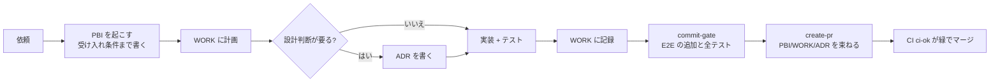

# 開発の進め方 (PBI 駆動)

人もエージェント (Claude Code / Codex / Kimi) も、**ベースの実装は PBI ありきで進める**。
コードより先に「何を・なぜ・どうなれば完了か」を PBI に書き、作業の計画と記録を WORK に残し、設計判断は ADR に残す。

この手順は Self 組織の共通スキル (`plugins/self-base/`) の `start-pbi` / `create-pr` と対になっている。スキルはこのファイルを正として読む。

## 3 つの文書

| 文書 | 置き場所 | 書くこと | 寿命 |
| --- | --- | --- | --- |
| **PBI** (Product Backlog Item) | `docs/pbi/<番号>-<slug>/PBI.md` | 背景・目的 / やること / やらないこと / 受け入れ条件 / 状態 | PR がマージされたら「完了」。消さない |
| **WORK** (作業ファイル) | `docs/pbi/<番号>-<slug>/WORK.md` | タスクと完了の確かめ方 / 日付付きの記録 (判断・詰まり・方針変更) / 検証結果 | PBI と同じ |
| **ADR** (設計判断の記録) | `docs/adr/NNNN-*.md` | 戻すのにコストがかかる選択の背景・決定・選択肢 | 覆すときは新しい ADR で置き換える |

- PBI と WORK は 1 つのフォルダにまとめ、番号で結びつける
- ADR は PBI をまたいで参照されるので別の場所に置き、PBI の「関連 ADR」からリンクする
- 雛形: [docs/pbi/_template/](../pbi/_template/)、[docs/adr/template.md](../adr/template.md)

## 流れ

1. **PBI を起こす** (`/self-base:start-pbi`)
   - 受け入れ条件は「確かめられる形」で書き、それぞれに対応するテスト (E2E の観点やユニット) を決める
   - 受け入れ条件が書けないほど曖昧なら、着手前に依頼者に確認する
2. **WORK に計画を書く**: タスクと、その完了の確かめ方
3. **ADR が要るか判断する**。次のどれかに当たれば ADR を書いてから実装する
   - ライブラリ・外部サービス・デプロイ先の採用や変更
   - ディレクトリ構成やコンポーネントの層の変更 ([docs/design/components.md](../design/components.md))
   - デザインテーマのトークンの追加・意味の変更 ([docs/design/theme.md](../design/theme.md))
   - `testing/e2e-policy.yml` の観点の追加・必須化、CI の品質ゲートの変更
4. **実装とテスト**: [AGENTS.md](../../AGENTS.md) の「テストの方針」に従う。画面・機能を変えたら E2E を足す
5. **WORK に記録する**: 判断したこと、方針を変えたこと、見送ったことを日付付きで
6. **コミット**: `commit-gate` スキル (`pnpm commit-gate`) を通してからコミットする。フックが合格していないコミットを止める
7. **PR**: `/self-base:create-pr` で作る。PBI の受け入れ条件をすべて満たしてから出す
8. **マージ**: CI の `ci-ok` (lint / 型 / ユニット / ビルド / E2E) が緑でないとマージできない

## PBI が要らないもの

- 誤字・リンク切れなどドキュメントだけの小さな修正
- E2E 巡回 ([e2e-patrol.md](e2e-patrol.md)) が足すテスト (巡回の手順自体が PBI の代わり)
- 依存パッケージのパッチ更新

迷ったら PBI を起こす。小さな PBI は数行で構わない。

## 番号と命名

- PBI は 4 桁の連番 + kebab-case の slug (`0002-works-detail-per-item`)
- ブランチ名は `<種類>/pbi-<番号>-<slug>` を基本にする (例: `feat/pbi-0002-works-detail`)。指定されたブランチ名があればそちらに従う
- コミットメッセージと PR のタイトルに PBI 番号を入れる (例: `feat: 作品ごとの詳細ダイアログ (PBI-0002)`)
