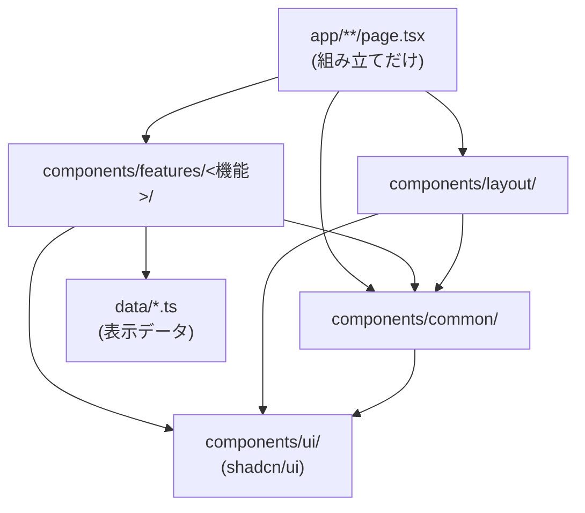

# コンポーネントの構成

決定の経緯は [ADR 0005](../adr/0005-component-architecture.md)、見た目の約束事は [theme.md](theme.md)。
新しい部品を作ったら、この一覧に足す。

## 層と依存の向き

- 矢印の向きにだけ import してよい。逆向き (ui → common など) や features 同士の import はしない
- ページは `PageTemplate` で包み、中身は features / common の部品を並べるだけにする
- 表示する文言・数値は `data/` に置く。部品はデータを props か `data/` から受け取る

## 一覧

### ui (`components/ui/`): 基本部品 (shadcn/ui)

| 部品 | 役割 |
| --- | --- |
| `Button` | ボタン。variant: default / outline / secondary / ghost / link / destructive |
| `Badge` | 小さなラベル。variant: status (継続中) / secondary (参画先) / muted (使用技術) |
| `Card` | カードの面 |
| `Dialog` | モーダル。閉じるボタンの名前は「閉じる」 |
| `Tabs` | タブ切り替え (矢印キーで移動できる) |
| `Input` | 入力欄 |

### common (`components/common/`): 画面をまたいで使う部品

`import { Section, GlassPanel } from "@/components/common"` のように index から import する。

| 部品 | 役割 |
| --- | --- |
| `GlassPanel` | ガラス調の面 (`glass-panel`)。padding: md / lg |
| `Section` | h2 の見出し付きの区切り。size: md / lg |
| `Callout` | 一段目立たせる囲み。variant: emphasis (左に線) / tinted (薄い色) |
| `BulletList` | 黒丸の箇条書き |
| `TagList` | バッジを横に並べた一覧。`label` で何の一覧かを読み上げる |
| `TextLink` | 本文中のリンク。外部 URL は新しいタブで開き `rel="noopener noreferrer"` を付ける |

### layout (`components/layout/`): 全ページ共通の枠

| 部品 | 役割 |
| --- | --- |
| `PageTemplate` | タブ + h1 + 本文パネル。全ページの枠 |
| `BrowserTabs` | ブラウザ風のタブ (`nav`「ページ切り替え」、現在地に `aria-current="page"`) とアドレスバー。タブの中身は `lib/navigation.ts` |
| `AnnouncementBanner` | 上部のお知らせ (`region`「お知らせ」)。閉じられる |
| `RssButton` | RSS フィードへのリンク |
| `ThemeProvider` | next-themes。既定はダーク |

### features (`components/features/<機能>/`): ページ・機能ごとの部品

| 機能 | 部品 | データ |
| --- | --- | --- |
| career | `CareerTimeline`, `EngagementsDialog` | `data/career.ts` |
| skills | `SkillsVisualization`, `SkillRadar` | `data/skills.ts` |
| works | `WorkGallery`, `WorkCard`, `WorkDetailDialog`, `ArchitectureDiagram` | `data/works.ts` |
| chat | `ResumeChat`, `ChatBubble`, `SuggestionList` | — (API から) |
| background | `BackgroundScene`, `Scene` | `lib/theme.ts` の色 |

## 部品を作るときの約束

- **押せるものは `button` か `a`**。`div` に `onClick` を付けない (キーボードで操作できず、E2E でもロールで取れない)
- **要素にはロールと名前が付くようにする**。E2E は `getByRole` で取るので、名前のない領域には `aria-label` を付ける (例: 会話のログ、参画先の一覧)
- 見た目の種類は props (`variant` `size`) で表し、呼び出し側で長いクラスを組み立てさせない
- 色はトークンだけを使う ([theme.md](theme.md))
- ブラウザでしか描けないものは `useIsClient()` (`hooks/use-is-client.ts`) で出し分ける。`useEffect` で `setState` しない (lint で落ちる)
- コメントは日本語で、理由 (なぜそうするか) を書く
